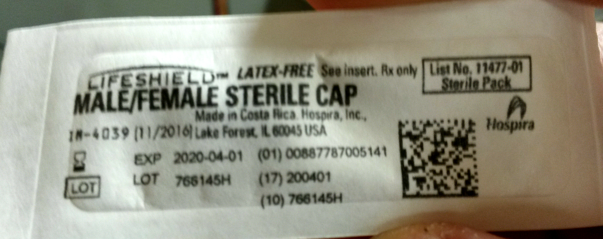

# Image Text Reader

This is an optical character recognition platform built specifically for medical equipment. 
Currently, it's designed to receive an input image of an equipment package (examples are found
in the folder `\examples`), from which it then parses out the lot number and expiration date,
two of the key identification components necessary to log and use medical equipment in standard
practice.

The software runs on OpenCV and PyTesser for image processing and character recognition, respectively.
* To install OpenCV (version 3.4.0 was used for this project), refer to 
[OpenCV-Python Tutorials](http://opencv-python-tutroals.readthedocs.io/en/latest/py_tutorials/py_setup/py_setup_in_windows/py_setup_in_windows.html#install-opencv-python-in-windows)
for Windows and [PyImageSearch](https://www.pyimagesearch.com/2016/11/28/macos-install-opencv-3-and-python-2-7/) for macOS
* To install PyTesser (version 0.0.1 was used for this project), refer to 
[Google's PyTesser code archive](https://code.google.com/archive/p/pytesser/wikis/README.wiki). Note that you'll also need to install
Pillow in order to process images using PyTesser (you can install Pillow by following their 
[installation documentation](http://pillow.readthedocs.io/en/3.1.x/installation.html))
* I also use imutils for miscellaneous resizing and processing tools. imutils is written by PyImageSearch, and you can find
the documentation and installation steps for it [here](https://github.com/jrosebr1/imutils)

The code runs through the following steps:
1. Filter the image so it's more readable and at a standardized size
2. Use a smart cropping algorithm to isolate the desired portion of the image and remove the background
3. Find the active sections of the image (i.e. where *something* is going on, be it an image or text)
4. Check if there are any helpful tags in the image (for example, an hourglass symbol for the expiration date) to 
aid detection of important text
5. Parse through the active sections from step 3 while referring to the tags from step 4 to determine which regions 
contain the desired information
6. Parse out the desired information from the text in the desired active section, and output to console

# How to Run Code:
There are two general ways to run this code. The first is to directly use the `main.py` function by passing in the desired
file location, and the second is to use the wrapper `CreateThumbnail.py` file to either automate the `main.py` procedure or to
connect the code to an Amazon S3 instance.

1. If you want to use `main.py` directly, call the following command: `py -2 main.py -i 'image_file_path'`
2. If you want to use the `CreateThumbnail.py`, edit the image file path you pass in to `handlerLocalTest()` in the 
`if __name__ == '__main__':` method. Then you can call it with the following command: `py -2 CreateThumbnail.py`

# Example Run:
For example, with the file `/examples/sample_image1.jpg` shown below:


The output of step 3 in the methodology above for this image (i.e. all of the active sections in the cropped image) is shown below:


And visualizing the output, which shows the final expiration date and lot number, we have the following:

And the program outputs to the console screen:
```
The item log number is 768145H
The expiration date is 2020-04-01
```